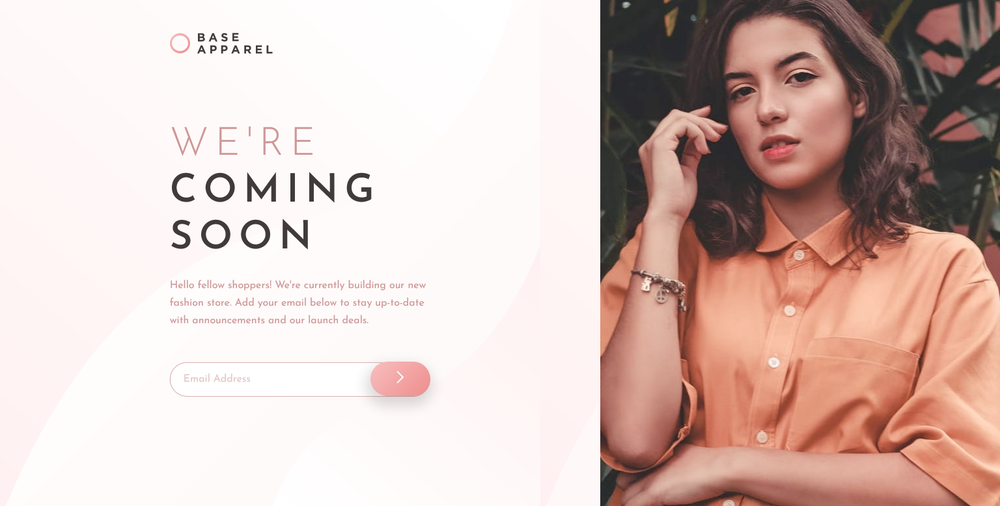

# Base Apparel Coming Soon Page


## Links
- [Challenge Link](https://www.frontendmentor.io/challenges/base-apparel-coming-soon-page-5d46b47f8db8a7063f9331a0)
- [Site Preview](https://robinjmm-base-apparel.netlify.app/)

## About
This is my solution for the challenge of building a Coming Soon page for a fictional company, Base Apparel. The challenge is from [Frontendmentor.io](https://www.frontendmentor.io).

This is my first time working with forms and form validations using JavaScript. It was definitely a challenging experience as I didn't have any idea how to implement one without relying on the browser's built-in validation methods. The trickiest part of the challenge came from checking if the email was valid or not. The solution I came up with was pattern matching using Regular Expressions.

I had a lot of fun doing this challenge, and I'm hoping I can do form validations better and faster in the future.

**Any feedback on how to improve my solution would be greatly appreciated.** 😊

## User Stories
The user should be able to:
- View the optimal layout for the site depending on their device's screen size
- See hover states for all interactive elements on the page
- Receive an error message when the form is submitted if:
    - The input field is empty
    - The email address is not formatted correctly

## Built With
- Semantic HTML5
- CSS3
- Flexbox
- Sass
- JavaScript

## Usage
You can download the project files by clicking on the green **Code** button, then select **Download Zip**.

Once you finish extracting, move into the project folder, open the terminal, and type the following code:

```
npm install
```

This will install all the required dependencies.

To compile Sass into CSS and watch for any future changes, type the following code in your terminal:


```
npm run sass
```

To compile Sass into a minified version of CSS, run:

```
npm run prod
```

## Acknowledgement
I'm very grateful to the people at [Frontendmentor.io](https://frontendmentor.io) for providing designs and challenges that help me improve my skills as a web developer.
